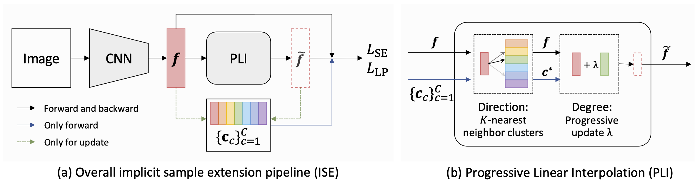

# ISE

The is the *official* repository with Pytorch version for [Implicit Sample Extension for Unsupervised Person Re-Identification](https://openaccess.thecvf.com/content/CVPR2022/papers/Zhang_Implicit_Sample_Extension_for_Unsupervised_Person_Re-Identification_CVPR_2022_paper.pdf). Please refer to [PaddleCls](https://github.com/PaddlePaddle/PaddleClas/blob/develop/docs/en/algorithm_introduction/ISE_ReID_en.md) for the *official* repository with Paddle version.

**This code is ONLY** released for academic use.

## Catalogue

- [1. Introduction](#1)
- [2. Instillation](#2)
- [3. Preparation](#3)
- [4. Train](#4)
- [5. Test](#5)
- [6. Main Results](#6)
- [7. References](#7)
- [8. Citation](#8)


<a name='1'></a>
## 1. Introduction

ISE (Implicit Sample Extension) is a simple, efficient, and effective learning algorithm for unsupervised person Re-ID. ISE generates what we call support samples around the cluster boundaries. The sample generation process in ISE depends on two critical mechanisms, i.e., a progressive linear interpolation strategy and a label-preserving loss function. The generated support samples from ISE provide complementary information, which can nicely handle the "sub and mixed" clustering errors. ISE achieves superior performance than other unsupervised methods on Market1501 and MSMT17 datasets.

> [**Implicit Sample Extension for Unsupervised Person Re-Identification**](https://openaccess.thecvf.com/content/CVPR2022/papers/Zhang_Implicit_Sample_Extension_for_Unsupervised_Person_Re-Identification_CVPR_2022_paper.pdf)<br>
> Xinyu Zhang*, Dongdong Li*, Zhigang Wang, Jian Wang, Errui Ding, Javen Qinfeng Shi, Zhaoxiang Zhang, Jingdong Wang<br>
> CVPR2022



<a name='2'></a>
## 2. Instillation

- Python 3.7.8
- Pytorch 1.2.0
- Torchvision 0.4.0
- Faiss-gpu 1.6.4
- Please refer to `setup.py` for the other packages with the corresponding versions.

<a name='3'></a>
## 3. Preparation
1. Run `git clone https://github.com/zhangxinyu-xyz/ISE-ReID.git`
2. Prepare dataset
    a. Download datasets: Market-1501 and MSMT17 (from [Aliyun](https://virutalbuy-public.oss-cn-hangzhou.aliyuncs.com/share/data.zip))
    b. Move them to ```$ISE/data/```
    c. Insure the data folder like the following structure (otherwise you should modify the data path in ```~/clustercontrast/datasets/[DATANAME].py```):
```
$ISE/data
    market1501
      Market-1501-v15.09.15
          bounding_box_train
          bounding_box_test
          query
    msmt17
      MSMT17_V1
        bounding_box_train
        bounding_box_test
        query
```
    d. (optional) Download the pretrained model first, and put the model into: ```./model/```.

<a name='4'></a>
## 4. Train
You can directly run `ISE_*.sh ` file for the transferring training process.

```
sh ISE_train_market1501.sh  ### for Market1501
sh ISE_train_msmt17.sh  ### for MSMT17
```

With **Pytorch 1.2.0**, we shall get about 84.7%/93.5% ($\pm 0.5\%$) mAP/top-1 on Market-1501 and 34.8%/64.7% ($\pm$ 0.5%) mAP/top-1 on MSMT17.

Note that we use **4 GPUs**.

<a name='5'></a>
## 5. Test

You can simply run `test_*.sh ` file for the transferring testing process.

```
sh ISE_test_market1501.sh  ### for Market1501
sh ISE_test_msmt17.sh  ### for MSMT17
```
We shall get about **84.7%/94.0%%** top-1/mAP on Market-1501 and **35.0%/64.8%** top-1/mAP on MSMT17.

<a name='6'></a>
## 6. Main Results

The main results on Market1501 (M) and MSMT17 (MS). PIL denotes the progressive linear interpolation strategy. LP represents the label-preserving loss function.

| Methods | M | Link | MS | Link |
| --- | -- | -- | -- | - |
| Baseline | 82.5 (92.5) | - | 30.1 (58.6) | - |
| ISE (+PIL) | 83.9 (93.9) | - | 33.5 (63.9) | - |
| ISE (+LP)  | 83.6 (92.7) | - | 31.4 (59.9) | - |
| ISE (Ours) (+PIL+LP) | **84.7 (94.0)** | [ISE_M](https://drive.google.com/file/d/146QALcH-m0tdAhqx59ICZ-uOaMpXicLn/view?usp=sharing) | **35.0 (64.8)** | [ISE_MS](https://drive.google.com/file/d/1QgVTe232CQC3FJ095Kd37uLT5N85s3uN/view?usp=sharing) |

<a name='7'></a>
## 7. References
[1] Our code is conducted based on [ClusterContrast](https://github.com/alibaba/cluster-contrast-reid).

[2] [Cluster Contrast for Unsupervised Person Re-Identification](https://arxiv.org/pdf/2103.11568v3.pdf)

[3] [Implicit Sample Extension for Unsupervised Person Re-Identification](https://openaccess.thecvf.com/content/CVPR2022/papers/Zhang_Implicit_Sample_Extension_for_Unsupervised_Person_Re-Identification_CVPR_2022_paper.pdf), CVPR2022

<a name='8'></a>
## 8. Citation

If you find this code useful in your research, please kindly consider citing our paper:

    @inproceedings{zhang2022implicit,
      title={Implicit Sample Extension for Unsupervised Person Re-Identification},
      author={Zhang, Xinyu and Li, Dongdong and Wang, Zhigang and Wang, Jian and Ding, Errui and Shi, Javen Qinfeng and Zhang, Zhaoxiang and Wang, Jingdong},
      booktitle={Proceedings of the IEEE/CVF Conference on Computer Vision and Pattern Recognition},
      pages={7369--7378},
      year={2022}
    }

